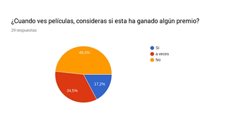
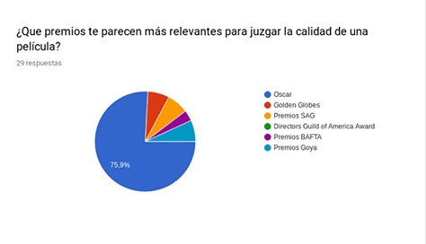
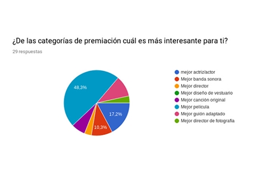
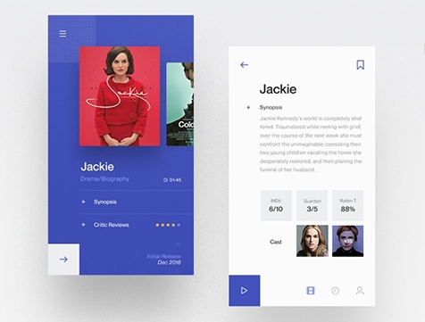
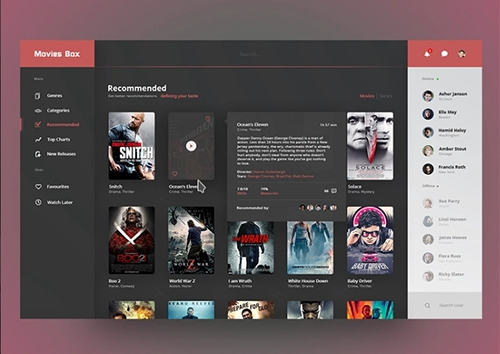
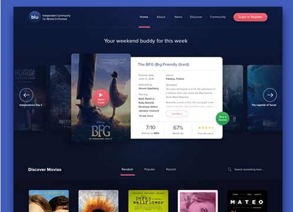
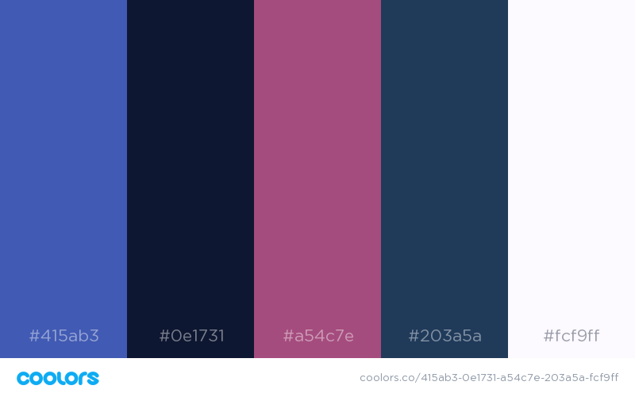
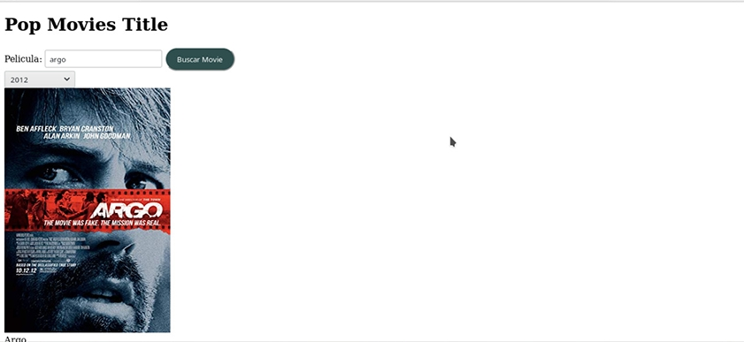
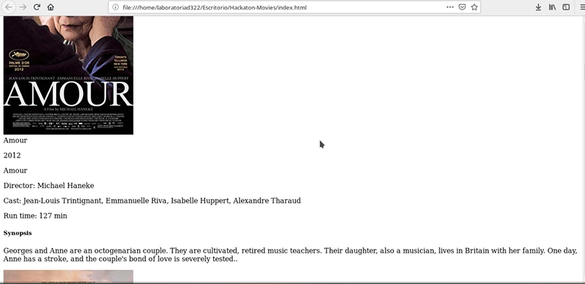

# "Hackathon" de final de _Common Core_, películas

 ## Índice

* [Presentación de la página web](#POPMOVIES)
* [Preámbulo](#preámbulo)
* [Investigación de Usuario](#cinvestigación-de-usuario)
* [Historias de Usuario](#Historias-de-Usuario)
* [Referencias visuales](#Referencias-visuales)
* [Guía de estilos](#Guía-de-estilos)
* [Primera iteración](#Primera-iteración)

 ***
 ## **POPMOVIES**
 

 Con la aparición de plataformas para ver películas en la nube, como Netflix o
Hulu, ver películas desde donde estés, comiendo lo que quieras
(sin tener que pagar precios ridículos por pop-corn / pipoca / palomitas /
canchita / cabritas), parando si es necesario, teniendo acceso a una cantidad
abrumadora de películas... ha cambiado la experiencia del usuario
y modificado el mercado de las películas a nivel global.

Pensando en las crecientes necesidades de los usuarios que consumen películas regularmente, hemos creado POPMOVIES, una página web que permite filtrar las películas según los premios que estas han recibido. Esta dirigida a un usuario conocedo y amante del cine, con estándares de calidad altos en cuanto al producto que consume.

## **Preámbulo**

 

 ## **Investigación de usuario**

* Como un primer acercamiento para conocer al usuario realizamos una encuesta con un muestreo de 29 personas.
 
[Encuesta](https://docs.google.com/forms/d/e/1FAIpQLSe2d9NFO8auWaLvLg-drgCDPLfH6nzCC7Dk51G0cgnDNekDxg/viewform?usp=sf_link)

**Análisis encuesta**

De un muestreo total de 29 usuarios un 34,5% considera las premiaciones de las películas para decidir si verlas o no, este es el usuario al que apuntaremos como público objetivo de nuestra página web. Decidimos también que nuestros filtros de premiaciones se basaran en las categorías  de los Oscars, ya que fueron los más votados con un 75,9% por sobre otros galardones como los BAFTA, Golden globes, SAG y Goya. La categoría más votada como relevante en cuanto a las premiaciones fue el premio a mejor película, con un 48,3%, por lo tanto este será nuestro filtro disponible para los usuarios de la plataforma.

**Definición de Usuario**

Estamos apuntando a un usuario tipo que es un asiduo consumidor de cine en plataformas online, es una persona con un gusto especial por el cine, puede tomarlo como un hobby o pasatiempo o como una disciplina seria, de cualquier forma el usuario se considera a sí mismo como un experto en la materia, es por esto que considera relevante ver películas que han sido aclamadas por la crítica, ya que se considera a sí mismo como parte de la crítica.

 ## **Historias de usuario**

 * COMO: Amante del cine y conocedor
   QUIERO: Conocer los estrenos más recientes de las películas que han sido premiadas
   PARA: Poder escoger que película ver

 * COMO: Entusiasta del cine y consumidor asiduo de películas
   QUIERO: Buscar películas específicas para conocer los premios que ha ganado
   PARA: Poder escoger que película ver

* COMO: Consumidor de cine 
  QUIERO: Poder filtrar las películas que han sido premiadas por año
  PARA: Poder escoger que película ver
  

 ## **Referencias visuales**

 

 

 

 
## **Guía de estilos**

**Paleta de colores**

**Logos**

## **Primera iteración**

## **Logos tentativos**

## **¿Qué es la Feria de demos?**

La feria de demos se realizará el día de las presentaciones, consiste en la dinámica de “speed dating”, cada squad presentará su demo durante 3 minutos a un grupo de personas, entre ellos los jurados de la Hackathon. Luego de los 3 minutos sonará una chicharra y el grupo de personas rotará al siguiente squad, de esta forma deberán presentar durante una hora. 

* Las demos no deben durar más de 3 minutos y deben mostrar el producto y las tecnologías usadas.
* Los asistentes van a votar por los 4 equipos finalistas, quienes tendrán la oportunidad de hacer su demo a todo el público para poder elegir un ganador. 
