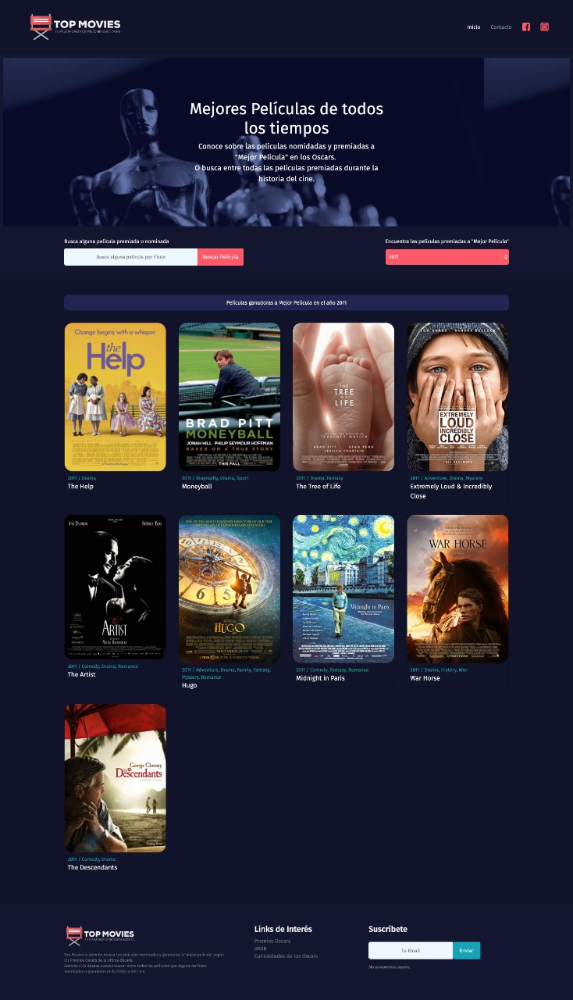

## Índice

* [Presentación de la página web](#POPMOVIES)
* [Investigación de Usuario](#cinvestigación-de-usuario)
* [Historias de Usuario](#Historias-de-Usuario)
* [Referencias visuales](#Referencias-visuales)
* [Guía de estilos](#Guía-de-estilos)
* [Primera iteración](#Primera-iteración)
* [Prototipo de alta fidelidad](#Prototipo-de-alta-fidelidad)
* [Evaluación Heurística](#Evaluación-Heurística)
* [Segunda Iteración](#Segunda-Iteración)

 ***
 ## **POPMOVIES**
 
 Con la aparición de plataformas para ver películas en la nube, como Netflix o
Hulu, ver películas desde donde estés, comiendo lo que quieras
(sin tener que pagar precios ridículos por pop-corn / pipoca / palomitas /
canchita / cabritas), parando si es necesario, teniendo acceso a una cantidad
abrumadora de películas... ha cambiado la experiencia del usuario
y modificado el mercado de las películas a nivel global.

Pensando en las crecientes necesidades de los usuarios que consumen películas de forma regular, hemos creado POPMOVIES, una página web que permite filtrar las películas según los premios que estas han recibido. Esta dirigida a un usuario conocedor y amante del cine, con estándares de calidad altos en cuanto al producto que consume.

 ## **Investigación de usuario**

* Como un primer acercamiento para conocer al usuario realizamos una encuesta con un muestreo de 29 personas.
 
[Encuesta](https://docs.google.com/forms/d/e/1FAIpQLSe2d9NFO8auWaLvLg-drgCDPLfH6nzCC7Dk51G0cgnDNekDxg/viewform?usp=sf_link)

**Análisis encuesta**

De un muestreo total de 29 usuarios un 34,5% considera las premiaciones de las películas para decidir si verlas o no, este es el usuario al que apuntaremos como público objetivo de nuestra página web. Decidimos también que nuestros filtros de premiaciones se basaran en las categorías  de los Oscars, ya que fueron los más votados con un 75,9% por sobre otros galardones como los BAFTA, Golden globes, SAG y Goya. La categoría más votada como relevante en cuanto a las premiaciones fue el premio a mejor película, con un 48,3%, por lo tanto este será nuestro filtro disponible para los usuarios de la plataforma.

**Definición de Usuario**

Estamos apuntando a un usuario tipo que es un asiduo consumidor de cine en plataformas online, es una persona con un gusto especial por el cine, puede tomarlo como un hobby o pasatiempo o como una disciplina seria, de cualquier forma el usuario se considera a sí mismo como un experto en la materia, es por esto que considera relevante ver películas que han sido aclamadas por la crítica, ya que se considera a sí mismo como parte de la crítica.

## **Historias de usuario**

 * COMO: Amante del cine y conocedor
   QUIERO: Conocer los estrenos más recientes de las películas que han sido premiadas
   PARA: Poder escoger que película ver

 * COMO: Entusiasta del cine y consumidor asiduo de películas
   QUIERO: Buscar películas específicas para conocer los premios que ha ganado
   PARA: Poder escoger que película ver

* COMO: Consumidor de cine 
  QUIERO: Poder filtrar las películas que han sido premiadas por año
  PARA: Poder escoger que película ver
  

 ## **Referencias visuales**

 

 

 

 
## **Guía de estilos**

**Paleta de colores**

**Logos**

## **Primera iteración**

## **Test de usabilidad**

Entrevistador: 
Fecha:
Sitio Web: 

**NOTA para la aplicación prueba:** 
- Entregar todas las instrucciones de forma simple y repetitiva. 
- Mantener una actitud paciente con el usuario, evitando “caras” de impaciencia, enojo, preocupación o cualquier gesto que haga sentir mal o presionado al usuario 
- Anotar todo lo posible 
- Aparte de las instrucciones necesarias para completar la prueba, no se deben entregar pistas al usuario de lo que tiene que hacer cuando navegue el sitio web. 

 <Nombre usuario>, agradecemos tu disposición de participar en esta “Prueba de Usabilidad”  que nos ayudará a detectar problemas en el sitio que desarrollamos.  Es importante que sepas que ésta prueba solo busca medir la usabilidad de nuestro sitio y no tu desempeño en el. Vamos a comenzar con algunas preguntas que nos permitirán saber quién eres y cómo utilizas Internet. 

 ___

#### Presentación del Usuario
1. ¿Cual es su nombre?
 *Alejandra Olivo* 
2. ¿A qué se dedica [Profesión, Actividad]? 
  *Soy contadora*
3. ¿Te consideras un consumidor recurrente de películas? 
  *Totalmente, es mi pasatiempo principal yo creo.*
4. ¿Visitas sitios que traten sobre cine?, Si es así ¿Que tan seguido? 
  *Visito seguido los sitios que tienen películas online, porque netflix igual se hace poco.*
5. ¿Que consideras al momento de escoger que película ver?
  *Cuando se estreno, me gusta ver estrenos, también el género de la película, hay cosas que no veo, como las peliculas de acción*

#### Identidad
*estas preguntas se realizaran luego de que el usuario observe la pantalla inicial y antes de que interactue con cualquier función de la página*

1. ¿Con la información entregada en la pantalla, puedes identificar con que marca o corporación se relaciona la aplicación web? ¿Como lo sabes?
 *Es una plataforma de recomendación de películas*
2. ¿Viste algún elemento gráfico que te ayudara a llegar a esta conclusión?
  *El dibujito de la silla del logo*
5. ¿Hacia que tipo de audiencia crees que esta dirigida la aplicación web y porque?
  *En mi opinión esta dirigida a personas que disfrutan del cine y que también son consumidores exigentes, porque no a todos los usuarios les va a interesar saber sobre las premiaciones que tenga una película*

#### Contenido
*estas preguntas se deben realizar luego de que el usuario ya navegó a través de la página, a su ritmo, sin intervenciones del entrevistador*

1. ¿Te parecen relevantes los contenidos que te ofrecen los botones al inicio de la pantalla?¿Si no es así, cuáles te interesarían?
  *Le agregaría algunos filtros extras, ya que la gente que entra a sitios así suele buscar bastante información y solo el criterio de  las premiaciones podría no serles suficiente*
2. ¿Pudiste distinguir con una primera mirada el contenido más importante de la página? ¿cómo lo identificaste?
  *Vi las imágenes de las pelis, se veían ordenadas y agradables a la vista*
3. ¿Los textos usados tanto en la página en general como en los botones son lo suficientemente descriptivos de lo que ofrecen al interactuar con ellos?
  *Me pareció que todo se entendía*

#### Navegación

1. ¿Lograste entender fácilmente la forma en que se navega por el sitio?
  *Si*
2. ¿Te queda claro cómo volver atrás o como poder escoger otro filtro?
  *Si*
3. ¿La información que te ofrece la pantalla es clara en cuanto a en qué lugar del sitio estas o te sentiste perdido dentro del sitio?
  *Es clara, además el sitio es sencillo, así que no me sentí perdido*

#### Gráfica Web
1. ¿Consideras que gráficamente el sitio esta equilibrado, recargado o muy simple?
 *Si, creo que es minimalista y es lo mejor considerando que habrá harta recarga visual en cada imagen de las películas*

#### Utilidad

1. ¿Tras la primera mirada, te queda claro el objetivo del sitio y los contenidos que ofrece?, ¿Podrías mencionarlos?
  *Filtra por año las películas que han sido nominadas a mejor película en los Oscars*
2. ¿Crees que estos contenidos y servicios son de utilidad para ti?
  *Si*
   ___

#### Presentación del Usuario
1. ¿Cual es su nombre?
 *Fabián González* 
2. ¿A qué se dedica [Profesión, Actividad]? 
  *Soy Ingeniero en control de gestión*
3. ¿Te consideras un consumidor recurrente de películas? 
  *Las disfruto mucho, si tengo tiempo me gusta ver películas, pero no tengo tiempo tan seguido, así que tal vez no diría que recurrente*
4. ¿Visitas sitios que traten sobre cine?, Si es así ¿Que tan seguido? 
  *Si, visito sitios que hacen valoraciones de películas, mi favorito es Rotten Tomatoes, si quiero ir a ver una película al cine, siempre reviso que puntaje obtuvo ahí*
5. ¿Que consideras al momento de escoger que película ver?
  
  
#### Identidad
*estas preguntas se realizaran luego de que el usuario observe la pantalla inicial y antes de que interactue con cualquier función de la página*

1. ¿Con la información entregada en la pantalla, puedes identificar con que marca o corporación se relaciona la aplicación web? ¿Como lo sabes?
 *Entiendo que se relaciona con el cine, como con la crítica de cine.*
2. ¿Viste algún elemento gráfico que te ayudara a llegar a esta conclusión?
  *El logo, onda el nombre y el logo en sí de la página me dicen que se trata de cine*
5. ¿Hacia que tipo de audiencia crees que esta dirigida la aplicación web y porque?
  *Creo que esta dirigida a gente como yo que disfruta de ver películas*

#### Contenido
*estas preguntas se deben realizar luego de que el usuario ya navegó a través de la página, a su ritmo, sin intervenciones del entrevistador*

1. ¿Te parecen relevantes los contenidos que te ofrecen los botones al inicio de la pantalla?¿Si no es así, cuáles te interesarían?
  *Si, creo que un buscador es lo típico, y lo de buscar por año me parece interesante*
2. ¿Pudiste distinguir con una primera mirada el contenido más importante de la página? ¿cómo lo identificaste?
  *Lo primero que vi fue el logo y luego me fije en las películas*
3. ¿Los textos usados tanto en la página en general como en los botones son lo suficientemente descriptivos de lo que ofrecen al interactuar con ellos?
  Si, no hay muchos textos, yo creo que lo preciso, tal vez me faltó una explicación un poquito más extense de que es exactamente lo que ofrece el sitio.

#### Navegación

1. ¿Lograste entender fácilmente la forma en que se navega por el sitio?
  *Si*
2. ¿Te queda claro cómo volver atrás o como poder escoger otro filtro?
  *No me queda del todo claro, tal vez recargaría la página*
3. ¿La información que te ofrece la pantalla es clara en cuanto a en qué lugar del sitio estas o te sentiste perdido dentro del sitio?
  *No vi que hubiera algún indicador, pero tampoco sentí que lo necesitara, porque no es como que uno se vaya metiendo en un laberinto de páginas, es bien sencillo todo*

#### Gráfica Web
1. ¿Consideras que gráficamente el sitio esta equilibrado, recargado o muy simple?
 *Creo que es más simple que equilibrado, pero me gusta, porque no se ve tan saturado*

#### Utilidad

1. ¿Tras la primera mirada, te queda claro el objetivo del sitio y los contenidos que ofrece?, ¿Podrías mencionarlos?
  *Entiendo que ofrece un filtro por año, onda las películas que ese año han ganado premios.*
2. ¿Crees que estos contenidos y servicios son de utilidad para ti?
  *Si obvio, porque uno siempre esta bscando cosas nuevas que ver*

#### Presentación del Usuario
1. ¿Cual es su nombre?
 *Valentina Lara* 
2. ¿A qué se dedica [Profesión, Actividad]? 
  *Fotográfa*
3. ¿Te consideras un consumidor recurrente de películas? 
  *Si, siempre estoy metida en Netflix, yo creo que ya me he visto todas la series*
4. ¿Visitas sitios que traten sobre cine?, Si es así ¿Que tan seguido? 
  *No tan seguido, solo cuando no se que ver, y quiero alguna recomendación*
5. ¿Que consideras al momento de escoger que película ver?
  *Considero primero el género, también me fijo harto en la imagen de la portada como criterio para escoger*
  
  
#### Identidad
*estas preguntas se realizaran luego de que el usuario observe la pantalla inicial y antes de que interactue con cualquier función de la página*

1. ¿Con la información entregada en la pantalla, puedes identificar con que marca o corporación se relaciona la aplicación web? ¿Como lo sabes?
 *No se si una marca, si tuviera que decir una diría Netflix porque es la más popular ahora para ver películas y se trata de eso, de recomendar que películas ver*
2. ¿Viste algún elemento gráfico que te ayudara a llegar a esta conclusión?
  *El logo*
5. ¿Hacia que tipo de audiencia crees que esta dirigida la aplicación web y porque?
  *A las personas que ven peliculas y que les interesa ver un cine más "culto"*

#### Contenido
*estas preguntas se deben realizar luego de que el usuario ya navegó a través de la página, a su ritmo, sin intervenciones del entrevistador*

1. ¿Te parecen relevantes los contenidos que te ofrecen los botones al inicio de la pantalla?¿Si no es así, cuáles te interesarían?
  *Me gustaría ver tal vez otras categorías de premio, como el de mejor banda sonora*
2. ¿Pudiste distinguir con una primera mirada el contenido más importante de la página? ¿cómo lo identificaste?
  *Viendo el logo y leyendolo, entendí al tiro que se trataba de películas*
3. ¿Los textos usados tanto en la página en general como en los botones son lo suficientemente descriptivos de lo que ofrecen al interactuar con ellos?
  *Si, encuentro que los textos eran bastantes descriptivos, y usualmente la gente cuando entra ene stos sitios no es para leer mucha información, más bien para itrinear visualmente*

#### Navegación

1. ¿Lograste entender fácilmente la forma en que se navega por el sitio?
  *No tuve problemas*
2. ¿Te queda claro cómo volver atrás o como poder escoger otro filtro?
  *No tuve problemas en la navegación, aunque creo que tampoco intenté volver atrás*
3. ¿La información que te ofrece la pantalla es clara en cuanto a en qué lugar del sitio estas o te sentiste perdido dentro del sitio?
  *No me sentí perdido, no es como una página del gobierno, porque esas sí son terribles*

#### Gráfica Web
1. ¿Consideras que gráficamente el sitio esta equilibrado, recargado o muy simple?
 *Considero que bastante equilibrado, no hay muchos colores que distraigan*

#### Utilidad
1. ¿Tras la primera mirada, te queda claro el objetivo del sitio y los contenidos que ofrece?, ¿Podrías mencionarlos?
  *El objetivo es recomendar películas según yo*
2. ¿Crees que estos contenidos y servicios son de utilidad para ti?
  *Si, aunque no tan seguido, visito sitios así pero no de forma recurrente*  

## **Prototipo de alta fidelidad**

[Prototipo]("https://www.figma.com/file/HzJR8U9LjS2wEF3keXtPzx/Untitled?node-id=0%3A1")

[Imagen-Prototipo](img/figma-prototipo.pdf)

## **Evaluación Heurística**

[Evaluación]("https://docs.google.com/spreadsheets/d/1QeSxMuLWxxbM61vpMMwFgBs0ikwIy8odMzy-XL2vKlE/edit#gid=0")

**Conclusiones**

Luego de aplicar la evaluación pudimos establecer la prioridad de los que cambios que debíamos hacer en las siguientes iteraciones, como aplicar la paleta de colores definida para el sitio, incorporar el logo, reubicar los elementos siguiendo el principio de repetición. También decidimos darle dinámismo incorporando un carrousel para mostrar todas las películas que se requería mostrar. También centramos el contenido e incluimos un footer que siguiera con las convenciones de los sitios web que analizamos en nuestra primera investigación.

## **Segunda Iteración**

